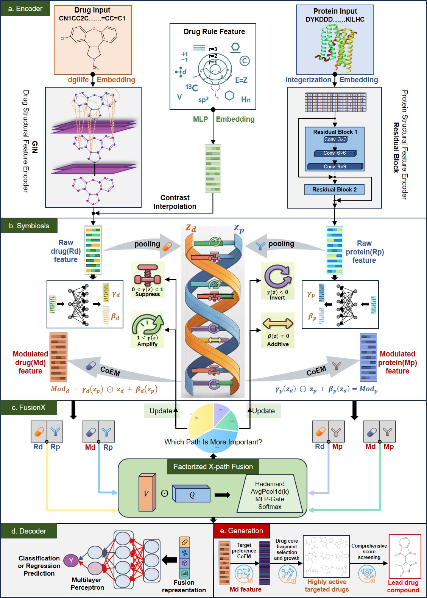
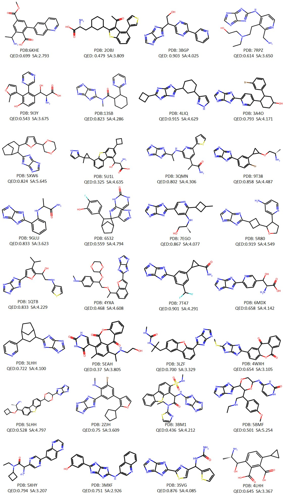

# SymfuseX: Bridging Predictive Modeling and Generative Design for Target-Specific Drug Discovery

> Multi-task deep learning framework for drug–target interaction / affinity prediction and target-preference molecule generation.
<p align="center">

</p>

## 🔍 Overview

**SymfuseX** is a unified framework that couples **drug–target prediction** with **target-conditioned molecule generation**.

It supports:

- ✅ **Drug–Target Interaction (DTI) classification**
- ✅ **Drug–Target Affinity (DTA) regression**
- ✅ **Target-preference molecule generation**

The core of SymfuseX is a **Symbiotic Fusion Mechanism**:

- A **symbiosis module** performs **dimension-wise CoEM-style modulation** between drug and protein representations, allowing both sides to co-adapt to each other’s binding preferences.
- A **fusion module** aggregates **raw** and **modulated** features along **multiple interaction paths** with a gating network, emphasizing paths that contribute most to binding probability and affinity.
- The resulting **target-conditioned drug descriptor** `Md` is reused as a **latent guidance vector** to drive fragment-based molecular generation around the target’s local chemical space.

## ⚙️ Installation & Requirements

### Tested environment

OS: Ubuntu 24.04.3 LTS

GPU: NVIDIA A100-SXM4-80GB × 4 (DGX class server)

Driver: 570.195.03

Python: 3.9.24

PyTorch: 2.7.1+cu118 (CUDA 11.8 runtime)

DGL: 1.1.3+cu118

DGL-LifeSci: 0.3.2

RDKit: 2024.09.5

NumPy: 1.26.3, Pandas: 2.3.2, Matplotlib: 3.9.4

importlib-metadata: 8.7.0

## Installation

We recommend creating a fresh conda environment before installing the dependencies.
### 1) Create and activate a new conda environment (Python 3.9)
```bash
conda create -n symfuseX python=3.9.24 -y
conda activate symfuseX
python -m pip install -U pip
```
### 2) Install RDKit (recommended via conda-forge)
```bash
conda install -y -c conda-forge rdkit=2024.09.5
```
### 3) Install the remaining Python dependencies
```bash
pip install -r requirements.txt
```
### 4) clone the source code of SymfuseX
 git clone https://github.com/fbbgood/SymfuseX.git

 cd SymfuseX

## 🚀 Run SymfuseX to Reproduce Results
Regardless of the task type, training can be launched with a single command.

### 1️⃣ Train DTI classification

**Set MAX_EPOCH to 100, BATCH_SIZE to 64 and LR to 5e-5 in SymfuseX.yaml**, then run:
```bash
python main.py --cfg "configs/SymfuseX.yaml" --task "DTI" --split "${split}" --dataset "${dataset}"
```
${split} can be random or fold; ${dataset} can be bindingdb, human, or biosnap.

For example, to run the human dataset under a random split:
```bash
python main.py --cfg "configs/SymfuseX.yaml" --task "DTI" --split "random" --dataset "human"
```

### 2️⃣ Train DTA regression

**Set MAX_EPOCH to 1000, BATCH_SIZE to 256 and LR to 5e-4 in SymfuseX.yaml**, then run:
```bash
python main.py --cfg "configs/SymfuseX.yaml" --task "DTA" --split "${split}" --dataset "${dataset}"
```
${split} can be random or cold; ${dataset} can be davis or kiba.

For example, to run the davis dataset under a random split:
```bash
python main.py --cfg "configs/SymfuseX.yaml" --task "DTA" --split "random" --dataset "davis"
```

### 3️⃣ Molecular generation

After completing the DTI and DTA tasks, a **.pth checkpoint will be produced for each**. Update the paths to these two checkpoints at the beginning of generate.py to load the trained models. Then, provide the input in /datasets/Generate-samples.csv (typically a known active drug–target pair) and run the following command to start the target-specific molecule generation pipeline:
```bash
python generate.py
```
We also provide pretrained DTI and DTA models, together with 10 example inputs. You can set the **SAMPLE_IDX parameter in generate.py (0–9)** to perform generation for different targets.To facilitate peer review and reduce evaluation time, we release a lightweight version of the generation pipeline. The full version will be made available in a subsequent update, packaged with a more user-friendly web-based UI.

**Additional de novo molecules generated for different targets(Target information can be found in the PDB database: https://www.rcsb.org/) are provided below. If anyone requires further data, please feel free to contact us.**
<p align="center">

</p>

## ✨✨ Acknowledgements
**❤️We thank the following studies for inspiring this work：**

[1] Bai P, Miljković F, John B, et al. Interpretable bilinear attention network with domain adaptation improves drug–target prediction[J]. Nature Machine Intelligence, 2023, 5(2): 126-136.<br>
[2] Perez E, Strub F, De Vries H, et al. Film: Visual reasoning with a general conditioning layer[C]//Proceedings of the AAAI conference on artificial intelligence. 2018, 32(1).<br>
[3] Feng B M, Zhang Y Y, Niu N W J, et al. Defusedti: Interpretable drug target interaction prediction model with dual-branch encoder and multiview fusion[J]. Future Generation Computer Systems, 2024, 161: 239-247.<br>
[4] Ilse M, Tomczak J, Welling M. Attention-based deep multiple instance learning[C]//International conference on machine learning. PMLR, 2018: 2127-2136.<br>

We sincerely thank the Editor and the anonymous reviewers for the time and effort they have devoted to improving the quality of this manuscript. We express our highest respect and best wishes in appreciation of their valuable contributions.❤️
